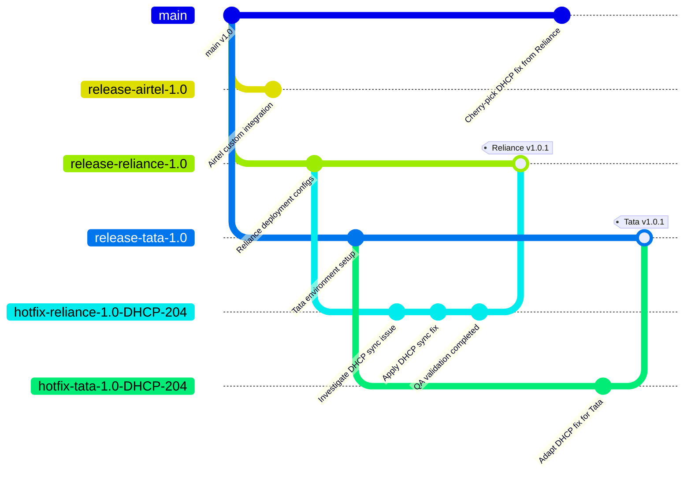

# Real-World Hotfix Workflow Demo Project (Enterprise GitHub Simulation)

## Overview

This project is a hands-on simulation of a real enterprise hotfix / CHF (Cumulative Hotfix) workflow using GitHub branching strategies.

The goal of this repository is to understand how enterprise production support teams manage:

- customer-specific release branches
- hotfix workflows
- Pull Requests (PR)
- regression validation
- canary deployment
- cherry-pick synchronization
- release management
- production-safe deployments

The workflow is demonstrated using a simplified Bitloka DDI Manager production issue scenario.

---

# Real Production Scenario

Suppose a customer (Reliance) reports a production issue:

```text
DHCP lease synchronization failure
```

on:

```text
release/reliance/1.0
```

Instead of directly fixing the issue in `main`, a dedicated hotfix branch is created from the affected release branch:

```text
hotfix/reliance/1.0-DHCP-204
```

The issue is fixed, validated, deployed safely, and then synchronized back into `main`.

---

# Repository Structure

```text
bitloka-hotfix-demo/
│
├── README.md
├── dhcp-sync.js
│
├── docs/
│   ├── hotfix-lifecycle.md
│   ├── canary-deployment.md
│   └── branching-strategy.md
```

---

# Branching Strategy Understanding

## Main Branch

The `main` branch contains:

- common product code
- future development
- shared application logic

Example:

```text
main
```

---

## Customer Release Branches

Separate release branches exist because customers may have:

- different deployment timelines
- environment-specific configurations
- custom integrations
- infrastructure differences

Example:

```text
release/airtel/1.0
release/reliance/1.0
release/tata/1.0
```

---

## Hotfix Branches

Hotfix branches are temporary branches used to isolate urgent production fixes.

Example:

```text
hotfix/reliance/1.0-DHCP-204
```

The hotfix branch is created from the affected release branch, not directly from `main`.

---

# Complete Hotfix Lifecycle

```text
Production Issue Reported
            ↓
Identify Affected Release Branch
            ↓
Create Hotfix Branch
            ↓
Develop & Validate Fix
            ↓
GitHub Pull Request & Review
            ↓
QA & Regression Testing
            ↓
Limited / Canary Deployment
            ↓
Gradual Production Rollout
            ↓
Merge Back to Release Branch
            ↓
Sync Required Fixes to Main
            ↓
Close/Delete Hotfix Branch
```

---

# Step-by-Step GitHub Workflow Simulation

## Step 1 — Create Repository

```bash
git init
git branch -M main
```

---

## Step 2 — Add Initial Production Service

Created:

```text
dhcp-sync.js
```

Initial commit:

```bash
git add .
git commit -m "Initial DHCP synchronization service"
```

---

## Step 3 — Create Customer Release Branches

```bash
git checkout -b release/airtel/1.0
git checkout main

git checkout -b release/reliance/1.0
git checkout main

git checkout -b release/tata/1.0
git checkout main
```

---

## Step 4 — Simulate Reliance Production Issue

Issue reported on:

```text
release/reliance/1.0
```

Issue:

```text
DHCP lease synchronization crash
```

---

## Step 5 — Create Hotfix Branch

```bash
git checkout release/reliance/1.0

git checkout -b hotfix/reliance/1.0-DHCP-204
```

---

## Step 6 — Implement Hotfix

Updated:

```text
dhcp-sync.js
```

Commit:

```bash
git add .
git commit -m "Fix DHCP-204 lease sync crash issue"
```

---

## Step 7 — Push Hotfix Branch

```bash
git push origin hotfix/reliance/1.0-DHCP-204
```

---

## Step 8 — Create Pull Request

GitHub PR flow:

```text
hotfix/reliance/1.0-DHCP-204
                    ↓
release/reliance/1.0
```

PR Title:

```text
Fix DHCP-204 lease sync crash issue
```

---

## Step 9 — Merge Pull Request

After validation and review:

```text
hotfix branch
        ↓
release branch
```

The production fix officially becomes part of the Reliance release branch.

---

## Step 10 — Canary Deployment Documentation

Created:

```text
docs/canary-deployment.md
```

Commit:

```bash
git add .
git commit -m "Add canary deployment plan"
```

---

## Step 11 — Create Second PR

Since the documentation commit happened after the first PR merge:

a second PR was required.

This demonstrates an important GitHub workflow behavior:

> Pull Requests only include commits available before merge time.

---

## Step 12 — Merge Documentation PR

Merged:

```text
Add canary deployment documentation
```

into:

```text
release/reliance/1.0
```

---

## Step 13 — Pull Latest Release Branch

```bash
git checkout release/reliance/1.0
git pull origin release/reliance/1.0
```

---

## Step 14 — Verify Commit History

```bash
git log --oneline
```

Observed:

```text
Merge pull request
Add canary deployment plan
Fix DHCP-204 lease sync crash issue
```

---

## Step 15 — Synchronize Fixes to Main

Switch:

```bash
git checkout main
```

Cherry-pick only required commits:

```bash
git cherry-pick fb0118b
git cherry-pick aa7080c
```

This demonstrates selective synchronization.

---

## Step 16 — Push Main

```bash
git push origin main
```

Now future releases also inherit the production fix.

---

## Step 17 — Verify Final Workflow

The repository now demonstrates:

- release branch workflow
- hotfix workflow
- PR lifecycle
- canary deployment understanding
- selective synchronization
- enterprise Git operations

---

## Step 18 — Cleanup

Optional cleanup:

```bash
git branch -d hotfix/reliance/1.0-DHCP-204
```

---

# Understanding Cherry-pick

Enterprise teams often avoid merging the complete customer release branch into `main`.

Instead:

```bash
git cherry-pick <commit-id>
```

is used to synchronize only required production fixes.

This prevents:

- customer-specific configurations
- deployment changes
- custom integrations

from unintentionally entering the common codebase.

---

# Canary Deployment Understanding

Instead of deploying the hotfix to all production systems immediately:

1. deploy to limited nodes
2. monitor logs and metrics
3. validate stability
4. gradually expand rollout

This reduces production deployment risk.

---

# Example Git Flow Visualization



---

# Key Learnings

From this project, I understood:

- why enterprise systems use release branches
- how hotfix branches isolate production fixes
- why PR reviews are important
- how regression testing protects production stability
- why cherry-pick is commonly used
- how canary deployment reduces production risk
- why release synchronization matters
- how GitHub PR timing affects commit inclusion

---

# Additional Documentation

Detailed explanations are available in:

- `docs/hotfix-lifecycle.md`
- `docs/canary-deployment.md`
- `docs/branching-strategy.md`

---

# Final Understanding

This project helped me practically understand how enterprise teams handle:

- production issues
- customer-specific releases
- hotfix deployments
- GitHub workflows
- release synchronization
- controlled production rollout strategies